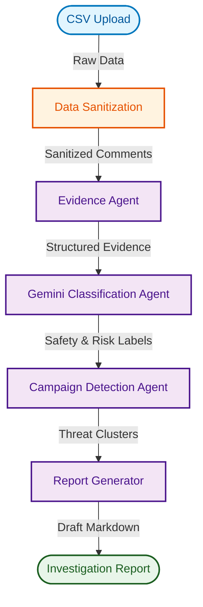

<div align="center">

# ⚖️ Apex Legal AI
**AI-Powered Threat Detection & Legal Evidence Investigation System**

[](https://python.org)
[](https://deepmind.google/technologies/gemini/)
[](https://fastapi.tiangolo.com)
[](https://opensource.org/licenses/MIT)

*A Multi-Agent decision support pipeline designed to help legal professionals and safety teams investigate online harassment campaigns and digital threats at scale.*

[Features](#features) • [System Workflow](#system-workflow) • [Installation](#installation) • [Sample Report](#sample-investigation-report)

</div>

---

## 🛑 Problem Statement
Digital platforms are overwhelmed with unstructured data, making it nearly impossible for legal teams and trust & safety moderators to manually identify coordinated harassment, credible threats, and spam campaigns. Traditional rule-based filters fail to understand context, leading to missed threats or massive false-positive backlogs.

## 💡 Solution Overview
**Apex Legal AI** is a state-of-the-art multi-agent system built on the Google Agent Development Kit (ADK) and powered by Gemini. It autonomously ingests raw social media data, normalizes it, classifies risks using semantic LLM reasoning, detects coordinated bot campaigns via structural clustering, and outputs a ready-to-review Markdown legal investigation report.

---

## ✨ Project Highlights & Features
- **✔ AI-powered comment moderation**: Semantic analysis of text to understand true intent beyond keywords.
- **✔ Multi-agent architecture**: Specialized agents handling distinct lifecycle phases (Evidence, Analysis, Campaign Detection, Reporting).
- **✔ Campaign detection**: Identifies coordinated inauthentic behavior (CIB) and bot swarms.
- **✔ Threat & harassment detection**: Classifies severity levels (1 to 4) for immediate triage.
- **✔ Automated legal investigation report generation**: Outputs a professional artifact ready for human review.
- **✔ Markdown evidence report**: Beautiful, easy-to-read audit trails.
- **✔ Human review checklist**: Enforces responsible AI by ensuring final decisions remain in human hands.

---

## 🖼️ Screenshots

<div align="center">

*Dashboard Overview*


*AI Evidence Classification*


*Automated Investigation Report*


</div>

---

## 🧠 Multi-Agent Architecture

Apex Legal AI utilizes a pipeline of specialized agents:

1. **Data Sanitization**: Cleans and normalizes incoming unstructured data.
2. **Evidence Agent**: Structurally standardizes the data into tamper-evident records.
3. **Analysis Agent**: Interfaces with Gemini to classify threat levels (Safe, Harassment, Threat, Spam).
4. **Campaign Detection Agent**: Groups similar comments across accounts and timestamps to detect coordinated attacks.
5. **Report Generator**: Compiles findings into a comprehensive legal-style Markdown brief.

### System Workflow



*(See [docs/architecture.md](docs/architecture.md) for more details on the agent pipeline).*

---

## 🛠️ Technologies Used

| Category | Technologies |
|---|---|
| **Language** | Python 3.10+ |
| **AI / LLM** | Google Gemini (via `google-genai`), Google ADK |
| **Backend API** | FastAPI, Pydantic |
| **Frontend UI** | Streamlit |
| **Data Processing** | Pandas, Scikit-Learn |
| **Testing & CI/CD** | Pytest, GitHub Actions |

---

## 🚀 Installation & Running the Project

### 1. Clone the repository
```bash
git clone https://github.com/yourusername/apex-legal-ai.git
cd apex-legal-ai
```

### 2. Set up Environment Variables
Create a `.env` file in the root directory based on the `.env.example`:
```bash
cp .env.example .env
```
Ensure you add your `GEMINI_API_KEY` to the `.env` file.

### 3. Install Dependencies
It is highly recommended to use a virtual environment.
```bash
python -m venv venv
source venv/bin/activate  # On Windows: venv\Scripts\activate
pip install -r requirements.txt
```

### 4. Run the Application
Start the Streamlit frontend:
```bash
streamlit run src/frontend/app.py
```
*(Or if running the FastAPI backend separately, use `uvicorn src.main:app --reload`)*

---

## 📂 Project Structure

```text
Apex-Legal-AI/
├── .github/                 # GitHub Issue/PR templates & Actions workflows
├── config/                  # Configuration files
├── docs/                    # Architecture and technical documentation
├── sample_data/             # Example CSV datasets for testing
├── screenshots/             # UI screenshots (placeholders)
├── src/                     # Core application source code
│   ├── agents/              # Multi-agent implementations (Analysis, Campaign, Evidence, Report)
│   ├── core/                # System state and orchestrator
│   ├── frontend/            # Streamlit application UI
│   └── main.py              # FastAPI entry point
├── tests/                   # Pytest suite and development scripts
├── .env.example             # Environment variables template
├── .gitignore               # Git ignore rules
├── pyproject.toml           # Project metadata
├── requirements.txt         # Python dependencies
├── CONTRIBUTING.md          # Contribution guidelines
├── CODE_OF_CONDUCT.md       # Code of conduct
├── SECURITY.md              # Security policies
├── LICENSE                  # MIT License
└── README.md                # Project documentation (You are here!)
```

---

## 📊 Sample Data Format

The system expects a CSV file containing social media comments. See `sample_data/sample_comments.csv` for a full example.

| Row | Username | Platform | Timestamp | Comment |
|---|---|---|---|---|
| 1 | user102 | Twitter | 2026-07-06 10:01:00 UTC | You are completely useless and should quit. |
| 2 | user103 | Instagram | 2026-07-06 10:02:00 UTC | I will find you tomorrow. Watch your back. |
| 3 | bot001 | Facebook | 2026-07-06 10:10:00 UTC | Click this link now for free money! |

---

## 📑 Sample Investigation Report

<details>
<summary><b>Click to expand a sample output report generated by the AI</b></summary>

# 🔍 Apex Legal AI — Investigation Report

> **DECISION SUPPORT DOCUMENT — NOT LEGAL ADVICE**

## Case Overview
**Case ID:** `3e950a6c-1c7e-420d-838e-ea528ba39280`
**Case Name:** Example Investigation

## 📊 Statistical Summary
- **Total Comments:** 25
- **Harmful Comments Detected:** 10 (40.0%)
- **Categories:** Spam (6), Harassment (3), Threat (1)

## 🕵️ Campaign Detection
**Status:** 🔴 **DETECTED**
1 cluster(s) of repeated messages from multiple accounts were identified.
*Repeated Message:* "Click this link now for free money!"

## 👁️ Human Review Required
- [ ] Verify the completeness and integrity of the source dataset.
- [ ] Review all comments classified as Threat individually before taking any action.
- [ ] Case manager sign-off.
</details>

---

## 🔮 Future Improvements
- **Cross-Lingual Support**: Implement automatic translation prior to analysis for multi-lingual campaign detection.
- **Advanced Threat Scoring**: Incorporate historical user reputational data to weigh severity scores dynamically.
- **Integration with Ticketing Systems**: Automatic export of case data to Jira or ServiceNow.
- **Explainability (XAI)**: Add highlighting to specific words inside the comment that triggered the LLM's classification.

---

## 📜 License
This project is licensed under the [MIT License](LICENSE).

## 👨‍💻 Author
**Apex Legal AI Team** — Built as a Capstone Project demonstrating advanced Multi-Agent architectures with Google ADK & Gemini.
