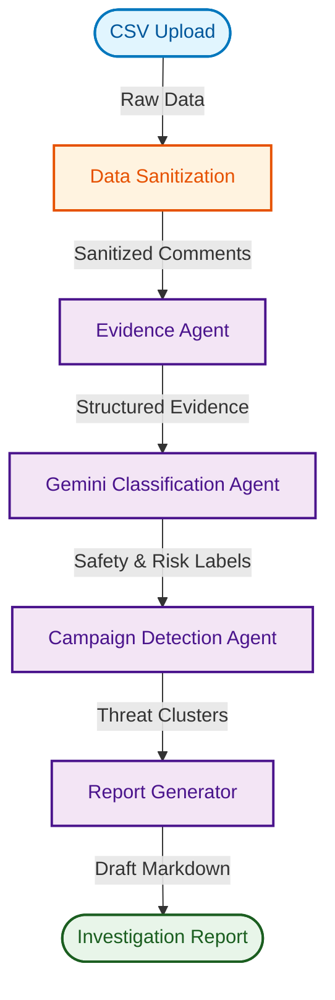

# Apex Legal AI Architecture

Apex Legal AI utilizes a multi-agent orchestration pattern built on top of the Google Agent Development Kit (ADK) and powered by Gemini.

The architecture is designed to cleanly separate concerns: ingesting raw data, organizing evidence, performing LLM-based safety evaluations, analyzing broader campaign patterns, and finally generating a human-in-the-loop legal review document.

## System Workflow

### Agent Roles

1. **Evidence Agent** (`EvidenceAgent`): Responsible for transforming raw unstructured input (such as rows from a CSV) into standardized `EvidenceRecord` schemas containing timestamps, platform information, and raw text.
2. **Analysis Agent** (`AnalysisAgent`): Interfaces with the Gemini LLM to semantically evaluate each piece of evidence. It assigns categories (Safe, Spam, Harassment, Threat) and severity scores based on carefully tuned system prompts.
3. **Campaign Agent** (`CampaignAgent`): Analyzes the output of the Analysis Agent across the entire dataset to detect coordinated inauthentic behavior, such as spam clusters or brigading attacks, by utilizing similarity clustering.
4. **Report Agent** (`ReportAgent`): Compiles all findings into a comprehensive Markdown report, rendering tables, calculating statistics, and adding the required human-in-the-loop review checklists.
